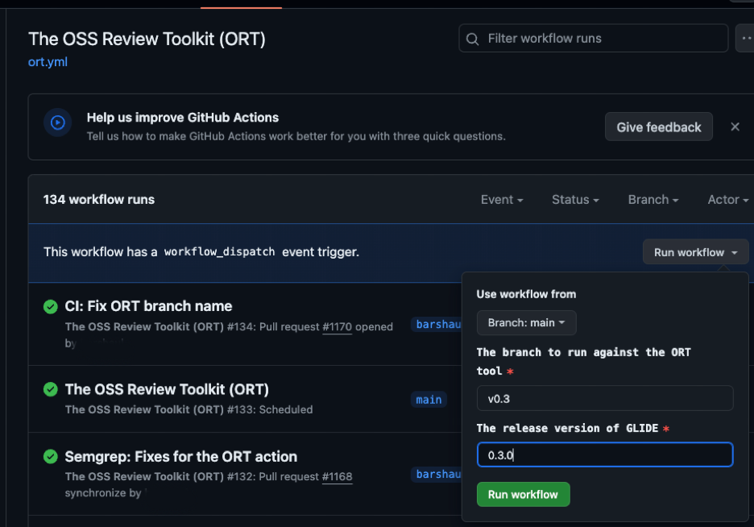
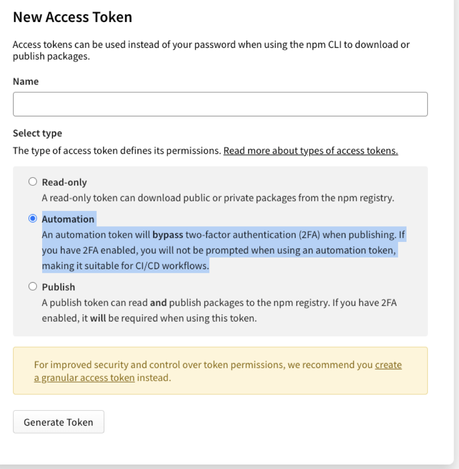

# Release Documentation

This document describes the process on how to release a new version of Valkey-GLIDE, how to use the GLIDE's CD workflows, and how to release a new wrapper.

Below is the table of contents.

- [Release Documentation](#release-documentation)
    - [Release Schedule](#release-schedule)
  - [GLIDE - How to release a new version](#glide---how-to-release-a-new-version)
    - [Update changelog](#update-changelog)
    - [Create release branch](#create-release-branch)
    - [Trigger the CD workflow and create a release candidate](#trigger-the-cd-workflow-and-create-a-release-candidate)
    - [Trigger the CD workflow for release](#trigger-the-cd-workflow-for-release)
  - [How to use GLIDE's CD workflows](#how-to-use-glides-cd-workflows)
    - [**How to trigger the CD workflow for Development**](#how-to-trigger-the-cd-workflow-for-development)
      - [**Self-hosted runner**](#self-hosted-runner)
    - [**PyPi**](#pypi)
    - [**NPM**](#npm)
      - [1. Create an account.](#1-create-an-account)
      - [2. Create an access tokens](#2-create-an-access-tokens)
    - [**Maven Central**](#maven-central)
  - [**GLIDE - How to release a new wrapper**](#glide---how-to-release-a-new-wrapper)

### Release Schedule

This section is currently under review. The release schedule will be soon published on the [wiki](https://github.com/valkey-io/valkey-glide/wiki).

## GLIDE - How to release a new version

Below are the steps required to release a new version:

### Update changelog

Verify all required changes / bug fixes / features in the [CHANGELOG](./CHANGELOG.md) are valid and expected in the file. Add a header with of the version and the release date above the described  changes. E.G. for releasing version 1.0.0 from version 0.4.0:
```
1.0.0 (2024-07-09)
Changes
* Node: Added ZINTERSTORE command ([#1513](https://github.com/valkey-io/valkey-glide/pull/1513))
* Python: Added OBJECT ENCODING command ([#1471](https://github.com/valkey-io/valkey-glide/pull/1471))

0.4.0 (2024-05-26)
Changes
* Python: Added STRLEN command ([#1230](https://github.com/valkey-io/valkey-glide/pull/1230))
```

### Create release branch

Open a PR to the main branch with the missing changes and the new version header, and continue after it’s merged.


2. **Ask a maintainer** to create a new branch named v$A.$B which can be made through the Github UI or on their local device.

    


1. **If it’s only a patch version and the branch already exists**, checkout the existing branch (e.g. `git checkout origin-valkey/v0.2`), and merge in the commit you’ve merged into main with the updates to the CHANGELOG.md file.
2. **Attributions file (ORT)**: Make sure the attributions file is updated by manually running the ORT workflow:

    a. Go to: https://github.com/valkey-io/valkey-glide/actions/workflows/ort.yml <br>

    b. **(Maintainer Only)** On the right corner, click on "Run workflow" and set the branch to run against the ORT tool to your newly created branch name (e.g. v0.3), and the exact release version (e.g. 0.3.0) <br>

    c. <br>
    

    d. If diff is found the workflow will open a PR in the release branch with the required changes. Make sure that all dependencies are approved by a Valkey-GLIDE maintainer. Merge the PR once it is ready.

### Trigger the CD workflow and create a release candidate

a. The CD workflow will deploy the code into the package managers of the different wrappers. If there is any issue with the CD, **contact a Valkey-GLIDE maintainer**. There are multiple CD jobs, one per client. All CD actions can be found in the [workflows section](https://github.com/valkey-io/valkey-glide/tree/main/.github/workflows). Refer to Java CD as an [example](https://github.com/valkey-io/valkey-glide/blob/main/.github/workflows/java-cd.yml).

b. To trigger a new release we need to tag the new branch commit with the release version.
   A release candidate should be released before the real release in order to test the version, add
    `-rc$RC_VERSION:`

c. release candidate: `git tag v1.x.x-rc0`

d. Push the tag to the valkey/glide repo to trigger the CD action

e. release candidate: `git push origin-valkey v1.A.B-rc$RC_VERSION`

f. If your release candidare is unsuccessful, all you need to do is create new tag for the next RC version (e.g. v0.5.0-rc3 → v0.5.0-rc4).

g. Each client has its own release procedure once the release candidate is deployed:

* **Node:** all the test will automatically run and once the release candidate CD workflow is done successfully, we can immediately publish the release candidate to `npm`.

* **Python:** there’s no such support currently, so you'll first need to test the RC version you deployed on the different supported platform. You can do so by cloning the repo into each machine, go to [examples/python/requirements.txt](https://github.com/valkey-io/valkey-glide/blob/main/examples/python/requirements.txt).

* **Java:** CI tests will automatically be run, and CD will automatically publish the RC to Maven.  Note: maintainer approval is required twice: Once to start the release CI testing, and once to publish the RC package to Maven.

For example, this is the release process for Python.

i. From the root directory,
    run `cd examples/python`

j. Then,
    run `pip install -r requirements.txt`

k. Then,
    run `pip list` and validate that the right version has been installed.

l. run `python3 ../../utils/cluster_manager.py -r 1 -n 3 --cluster-mode`
    and
    `python3 ../../utils/cluster_manager.py -r 1 -n 1`

### Trigger the CD workflow for release

Example below is done in python.

a. Edit the file [standalone_example.py](https://github.com/valkey-io/valkey-glide/blob/main/examples/python/standalone_example.py) or [cluster_example.py](https://github.com/valkey-io/valkey-glide/blob/main/examples/python/standalone_example.py) to have the right port in the different functions and run python3.

b. Once the CD workflow and all test have passed, you can release a real version such as `git tag v1.3.0`.

c. Push the tag to the valkey/glide repo so it will trigger the CD action:

d. `git push origin-valkey v1.x.x`


2. Update the release notes in Github (**maintainer rights are required**)

a. Go to: https://github.com/valkey-io/valkey-glide/releases

b. Click on "Draft a new release"

## How to use GLIDE's CD workflows

For deployment guide, see the above section [GLIDE - How to release a new version](#glide---how-to-release-a-new-version).

### **How to trigger the CD workflow for Development**

The CD workflow can be triggered in several ways.

1. **By pushing a Version Tag**: Trigger the CD workflow by pushing a version tag in the format "v*.*." or "v*.*-rc".
For example, `v1.0.0-rc1`. When triggered by a push event with a version tag, all package manager CD workflows (e.g., pypi-cd.yml, npm-cd.yml, java-cd.yml) will be initiated.
The version will be extracted from the tag.
    ```
    [13:39:23] ubuntu $ git remote -vv
    origin  https://github.com/your-repo/valkey-glide (fetch)
    origin  https://github.com/your-repo/valkey-glide (push)
    origin-valkey      https://github.com/valkey-io/valkey-glide (fetch)
    origin-valkey      https://github.com/valkey-io/valkey-glide (push)
    ```

2. **By Workflow Dispatch:** Manually trigger the CD workflow using the "workflow dispatch" option.
This is done on a specific CD workflow by passing the required version as an input parameter in the format "v*.*.*" or "v*.*.*-rc*".
This method will not trigger deployments for other package managers and will not create a tag in the repository.

    

3. **Pull Requests:** Pull requests will trigger the CD workflows as "dry runs" without actually publishing to the package managers.
This ensures that changes do not break the CD logic. Note that PRs affecting the CD workflows (e.g., introducing changes in the CD paths) can only be opened from branches on the
`valkey-io/valkey-glide` main repo (rather than from forks) since running the CD, even without publishing, requires access to the repository's secrets.


#### **Self-hosted runner**

We use a self-hosted runner for Linux-arm64. We have an automated action to start the self-hosted runner, detailed here: [automatic action to start the self-hosted runner.](https://github.com/valkey-io/valkey-glide/pull/1128)

### **PyPi**

**Contact a Valkey-GLIDE maintainer** to have access to the Valkey PyPI account-they will be able to log in to the PyPI account along with generating API tokens if needed.

### **NPM**

**Contact a Valkey-GLIDE maintainer** to access the Valkey-GLIDE npm account.

#### 1. Create an account.

a. Once you have created your [NPM account](https://www.npmjs.com/signup). Ensure that you have 2FA enabled.
Then use npm login in your shell to sign in with it. Do not share a team account. You should generally be using an account unique to you.

b. When you're ready to make your first release (including checking that things are OK with npm pack), you can run npm publish.
Your artifacts will be uploaded to the registry, and your package will be live. You can view it at https://npmjs.com/package/package-name-here.

#### 2. Create an access tokens

a. Access Tokens → Generate new token → classic token

b. Use a separate [granular access token](https://docs.npmjs.com/about-access-tokens#about-granular-access-tokens) for every actor on every project.
For example, if you have CD automation publishing to npm on two projects, you should have two separate granular tokens, each of which only has permissions on a single project.
This reduces impact when you rotate these tokens and reduces risk if there is ever a security issue with a token.

c. **Use an Automation token so it could be used in CD workflow:**

An automation token will bypass two-factor authentication (2FA) when publishing.
If you have 2FA enabled, you will not be prompted when using an automation token, making it suitable for CI/CD workflows.



3. Change the NPM_AUTH_TOKEN secret in Github with the new access token.

4. Change the NPM_SCOPE variable to an empty string.


### **Maven Central**

**Contact a Valkey-GLIDE maintainer** about using a self-hosted runner.


## **GLIDE - How to release a new wrapper**

TODO list:

- [ ] Create a README.md file following the python [README](./python/README.md)
- [ ] Create a DEVELOPER.md file following the python [DEVELOPER.md](./python/DEVELOPER.md)
- [ ] Create examples following existing client [examples](./examples)-[python](./examples/python), [java](./examples/java), and [node](./examples/node).
- [ ] Update the main [README](./README.md) file with link to the new wrapper readme under Getting Started
- [ ] Update the Current Status in the main README file
- [ ] Make sure all required structures/types/enums are exported
- [ ] Create a workflow to automate code deployment to the relevant package manager (see pypi_cd.yml for example)
- [ ] Add this wrapper to the ort.yml workflow so it would generate contributions file for this wrapper, make sure that the folder has updated THIRD_PARTY_LICENSES_<WRAPPER> file.
- [ ] Check that there is no vulnerabilities
- [ ] Contact a Valkey-Glide maintainer for access to the GLIDE -  How to release a new version document to release the new version to the package managers.
